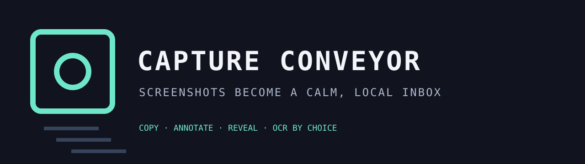
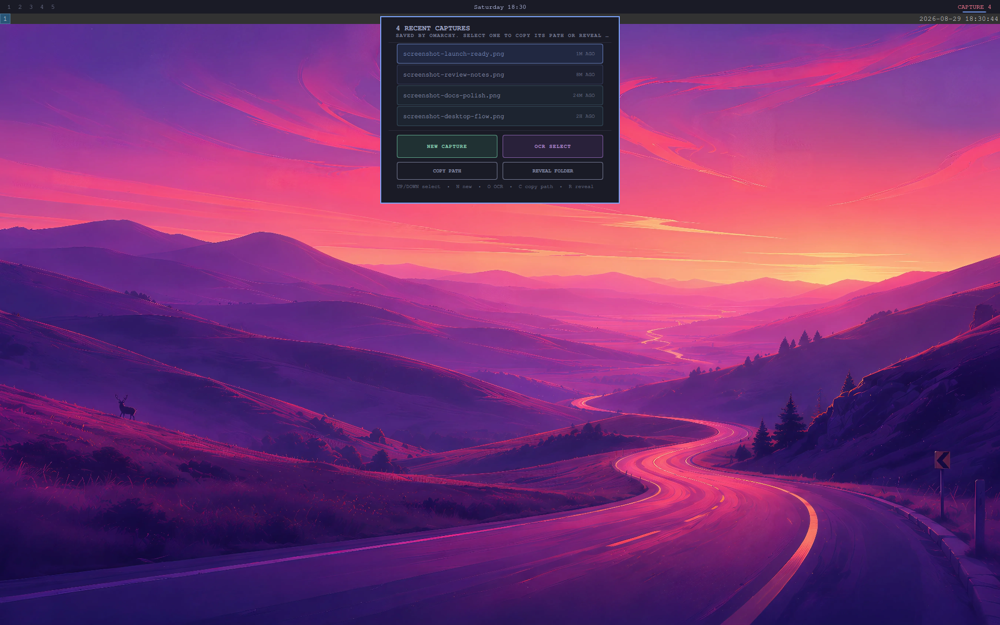

# Capture Conveyor



[](https://ko-fi.com/U5S225PTME)

Capture Conveyor turns saved Omarchy screenshots into a fast, keyboard-friendly
local inbox. It shows the newest 24 captures, keeps the current selection
obvious, and provides explicit actions for a new capture, path copy, folder
reveal, and a fresh OCR selection.



It follows Omarchy's `omarchy capture` interface and directory precedence:
`OMARCHY_SCREENSHOT_DIR`, then `XDG_PICTURES_DIR`, then `user-dirs.dirs`, then
`~/Pictures`. It inventories only top-level `screenshot-*.png` files. Stored
images are never OCRed or uploaded automatically.

All actions use fixed argv arrays. The scanner holds directory and file
descriptors while it reads metadata, rejects symlinked XDG config entries,
bounds every directory entry and filename byte before sorting, and never creates
a replaceable records file. Ready/attacked race fixtures prove config and capture
directory swaps cannot redirect the inventory. The QML model validates returned
paths again and clears stale selections before an action can receive one.

## Why it is different

- Arrow keys move through the recent-capture inbox.
- N starts Omarchy's native screenshot flow; O starts its native OCR selection.
- C copies the selected path; R reveals the configured capture folder.
- Failed external actions are visible in the panel instead of disappearing.
- No account, network request, upload, automatic OCR, or image-content read.

## Install

```bash
omarchy plugin add https://github.com/jeremylongshore/omarchy-capture-conveyor-entry --enable
```

Click a row to select it. Middle-click, right-click, or press C to copy its path.

## Verify

```bash
npm test
npm run test:race
npm run test:mutation
npm run audit
bash scripts/run-plugin-gates.sh
bash scripts/check-lane-freshness.sh
npm run test:e2e
```

## License

MIT
